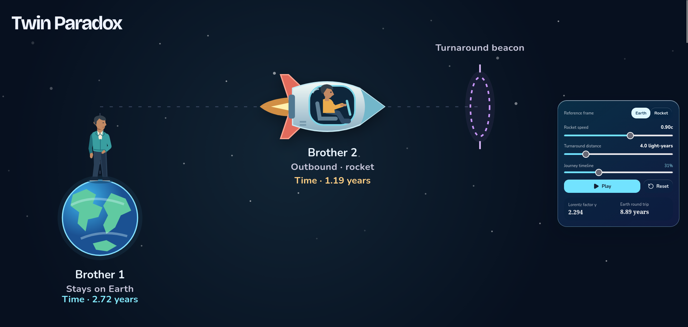
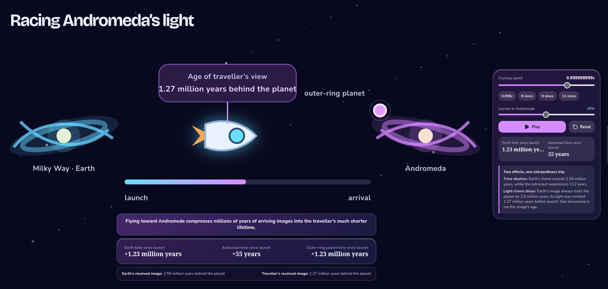
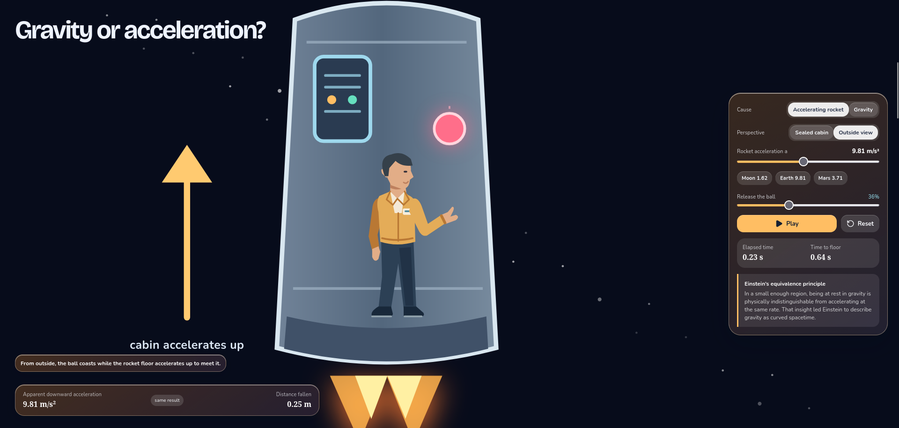
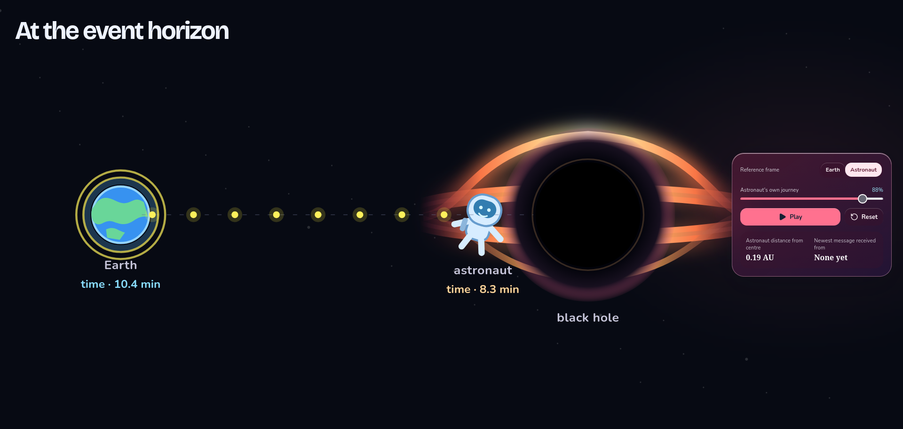
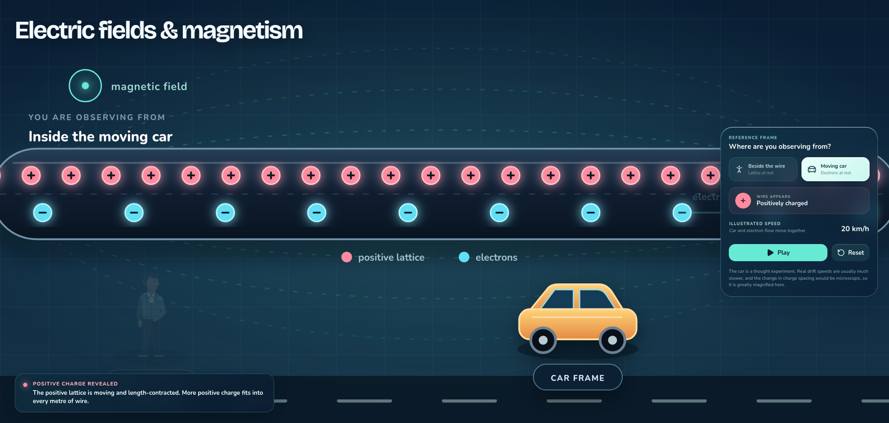

# Fun Physics Demos

A client-side collection of interactive, visual physics experiments. Each full-screen demo lets you change a frame of reference or physical parameter, then see the consequence in an animated SVG scene with live readouts.

Built with React, TypeScript, SVG, and Vite. No backend is required.

## Highlights

- Seven interactive demos spanning special relativity, general relativity, Newtonian gravity, black holes, and electromagnetism.
- Responsive, full-screen laboratory scenes with playback, reset controls, and accessible labels.
- Rendering-independent physics models with automated tests for the core calculations.
- Intentional visual exaggeration where an effect would otherwise be too small to see, with the scene explaining that choice.

## Gallery

<p align="center">
  
  
</p>
<p align="center">
  
  
</p>
<p align="center">
  
</p>

## Demos

| Topic | What you can explore |
| --- | --- |
| Twin paradox | Compare the clocks of two brothers as one travels to a distant marker and returns. |
| Gravity or acceleration? | Use Einstein's elevator to compare uniform gravity with an accelerating rocket. |
| Simultaneity of events | Switch between platform and train frames to see why simultaneous lightning strikes need not remain simultaneous. |
| Racing Andromeda's light | Follow a near-light-speed journey and compare what Earth and the traveller see of Andromeda's history. |
| Gravity is a two-body dance | Change mass ratio and sideways speed to create planetary wobbles, binary-star orbits, collisions, and escape trajectories. |
| At the event horizon | Compare a falling astronaut's experience with delayed, redshifted signals received on Earth. |
| Electric fields & magnetism | Change reference frame beside a current-carrying wire to see the electric–magnetic description shift. |

## Run locally

Prerequisite: a current Node.js LTS release.

```bash
npm install
npm run dev
```

Vite prints the local URL after starting the development server.

## Commands

```bash
npm run dev        # Start the development server
npm run build      # Type-check and create a production build
npm test           # Run the physics test suite once
npm run test:watch # Re-run tests while files change
npm run appimage   # Build a Linux AppImage in release/
```

## Linux desktop app

The [GitHub Releases](https://github.com/tefaz/interactive-physics-website/releases) page includes a portable Linux AppImage. After downloading it, make it executable and run it:

```bash
chmod +x Fun-Physics-Demos-*.AppImage
./Fun-Physics-Demos-*.AppImage
```

The AppImage bundles the app and does not need a separate Node.js installation.

## Project structure

```text
src/
├── components/  Shared scene shell, controls, and character illustrations
├── hooks/       Viewport-aware animation and simulation playback hooks
├── physics/     Rendering-independent models, constants, and tests
├── scenarios/   Per-demo interaction state and SVG scenes
└── utils/       Formatting helpers
```

## Physics and visual notes

- The two-body gravity demo integrates both bodies with velocity Verlet to reduce energy drift compared with a basic Euler step.
- Relativity demos use idealized setups—for example, instantaneous turnaround in the twin paradox—to focus on the underlying principle.
- The black-hole experiment uses Schwarzschild expressions for an `E = 1` radial geodesic and outgoing signal arrival times; its artwork is schematic.
- The electricity demo uses a thought-experiment car moving alongside the electron flow. At ordinary speeds the relativistic density change is far too small to draw, so the charge spacing is deliberately magnified.

Physical values and visual coordinates are kept separate throughout the project, and each scene labels its important approximations.
